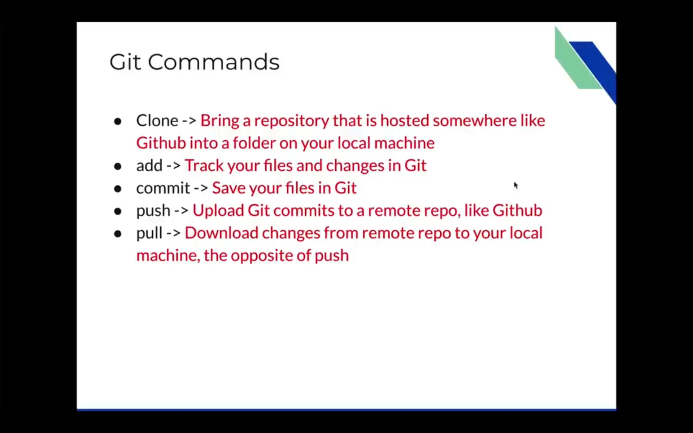
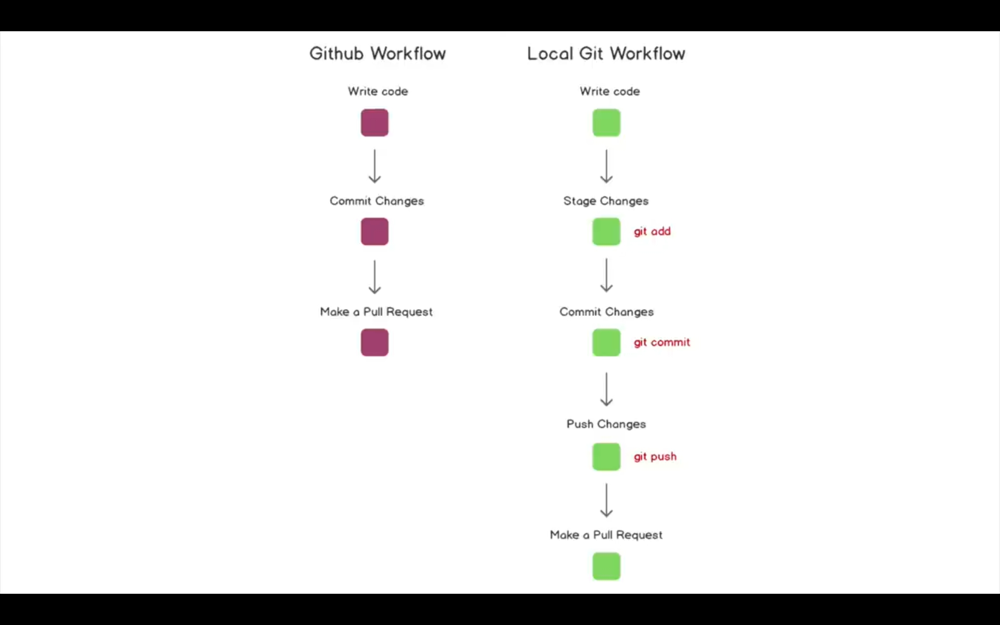
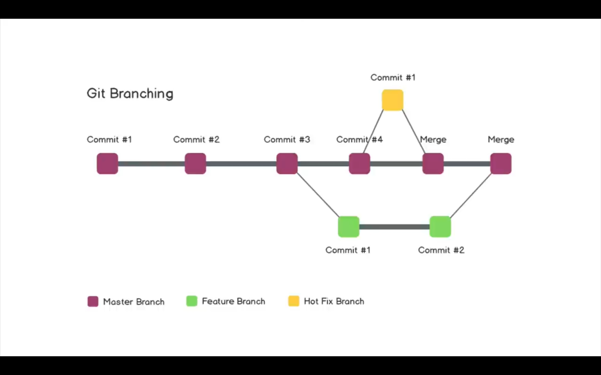

# GIT & GITHUB 
## GIT COMMANDS



To list hidden files: 
```
ls -la
```
To check status: 
```
git status
```
To track a file: 
```
git add file.txt
```
To untrack a file:
```
git restore file.txt
```
Commit the changes locally:
```
git commit -m "made first commit" -m "Added index.html and Made some changes to README.md"
```
## SSH Keys
To connect your local machine to github account to PUSH changes: 
Generate a ssh key locally
```
ssh-keygen -t rsa -b 4096 -C "abc@gmail.com"
```
key.pub will be uploaded, which is okay to be public <br>
Only the private key could have generated the public key.<br>
<br>
Start ssh-agent:
```eval "$(ssh-agent -s)"  
OR, ssh-agent -s
```
Add private SSH key: 
```
ssh-add mykey
```
## Git Push
```
git push origin main
```
set upstream: 
```
git push -u origin main
```
Note: **Use SSH, not HTTPS**
The main reason for any problem is mistakenly git clone the HTTPS URL; we need the SSH URL to use the SSH keys. The solution is to update the .git/config file, url value to SSH instead of HTTPS.
How to Update the URL of origin remote using SSH instead of HTTPS: 
```
git remote set-url origin git@github.com:username/repo.git
```
To Check: 
```
git remote -v
```
To add origin manually: (When push a locally created repo to github)
```
git remote add origin git@github.com:username/repo.git
```

## Branching
 
To list the branches: 
```
$ git branch
$ git checkout -b feature
Switched to a new branch 'feature'
```
To Find difference in two branches: 
```
git diff branch-name
```

NOTE: Merge will work locally but most seen approach is to push both the branches to the github and then make a pull request.
```
git merge branch-name
```
Pushing on a different branch: (first checkout that branch) 
```
git push origin branch-name
```
Then try making a *pull request* from github,
You can also add comments, resolve issues.

You may add more commits to the same pull request before it is merged to the main branch.
After it is merged, you have to manually fetch the changes in your local main branch.
```
git pull origin main
```
To Delete a branch (like feature) after it is merged to the main: 
```
git branch -d feature
```
## Merge Conflicts
To add & commit at the same time: 
```
git commit -am "modified index.html" -m "description"
```
Note: only works on modified files, because for new file you need to track/stage the files first.
```
$ git checkout quick-test
error: Your local changes to the following files would be overwritten by checkout:
	index.html
Please commit your changes or stash them before you switch branches.
Aborting
```
Commiting changes to main branch first, 
```
$ git commit -am "commiting changes to main branch " -m "commiting changes to main branch first to avoid conflict, will then later compare the main branch with the other (quick-test) branch "

$ git checkout quick-test
 
$ git diff main

$ git merge main
CONFLICT (content): Merge conflict in index.html
Automatic merge failed; fix conflicts and then commit the result.
```
Now you need to use editor like vscode to manually edit the code merge


## Undoing in Git

To Unstage a file or all files: 
```
$ git reset
$ git reset file-name
```
HEAD is pointer to the last commit: 
```
git reset HEAD~1
```
above code resets the last commits (or say undo it)
<br>
Log of all commits with hashcode: 
```
$ git log
$ git reset hash-of-commit
$ git reset --hard hash-of-commit
```
## Forking
Complete copy of some repo (including the branches)<br>
1. to make a pull request
2. to branch off a repo
3. complete control over code of repo

To get our change to get in the original repo, we need to pull request.

__These notes made from course by Gwen Faraday(@faradayacademy)__